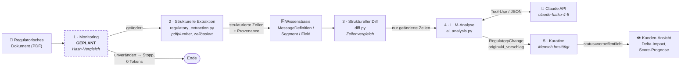
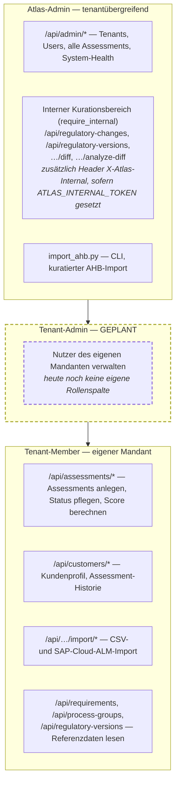
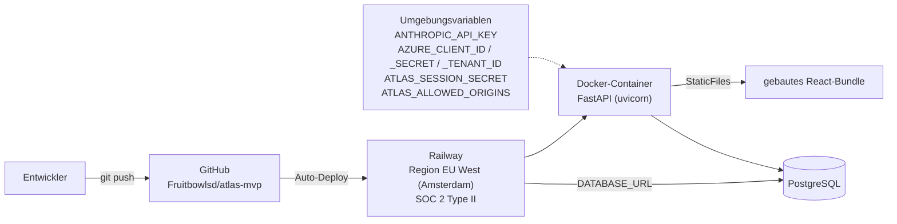

# Atlas — Architekturübersicht

Gesamtsystem-Sicht: welche Bausteine es gibt, wer mit wem kommuniziert, in welche
Richtung und über welches Protokoll bzw. Format.

**Stand:** 03.09.2026 · **Quelle:** `backend/app/`, `frontend/src/`,
`Atlas_Gesamtdokument.md` Teil B (Abschnitte 10–15)

Ergänzend: [Klassendiagramm des Datenmodells](class_diagram.md)

---

## 1. Gesamtarchitektur

```mermaid
flowchart TB

    %% =================================================================
    %% Nutzerrollen
    %% =================================================================
    subgraph Rollen["👤 Nutzerrollen"]
        direction LR
        AtlasAdmin["Atlas-Admin<br/><i>User.is_atlas_admin = true</i><br/>tenantübergreifend"]
        TenantAdmin["Tenant-Admin<br/><i>GEPLANT — heute keine<br/>eigene Rollenspalte</i>"]
        TenantMember["Tenant-Member<br/><i>User mit tenant_id</i><br/>sieht nur eigenen Mandanten"]
    end

    %% =================================================================
    %% Frontend
    %% =================================================================
    subgraph FE["🖥️ Atlas Frontend — React + TypeScript (Vite)"]
        direction LR
        FEApp["Kunden-UI<br/>Assessment, Heatmap,<br/>Score, Formatänderungen"]
        FEAdmin["Admin-UI<br/>Tenants, Users,<br/>Assessments, System"]
        FEClient["api/client.ts<br/><i>fetch, credentials: include</i>"]
    end

    %% =================================================================
    %% Backend
    %% =================================================================
    subgraph BE["⚙️ Atlas Backend — FastAPI (Python)"]
        direction TB
        subgraph API["REST-API — JSON über HTTPS"]
            direction LR
            RAuth["routers_auth<br/>/api/login, /auth/*"]
            RRef["routers_reference<br/>/api/requirements, …"]
            RAss["routers_assessments<br/>/api/assessments/*"]
            RImp["routers_import<br/>/api/…/import/*"]
            RReg["routers_regulatory<br/>/api/regulatory-changes,<br/>/api/assessments/…/regulatory-impact"]
            RAdm["routers_admin<br/>/api/admin/*"]
        end
        subgraph Domain["Fachlogik"]
            direction LR
            Auth["auth.py<br/>Session-Cookie,<br/>Tenant-Filter"]
            OIDC["oidc.py<br/>Authlib / OIDC"]
            Services["services.py<br/>Score-Berechnung,<br/>Findings"]
            Matching["matching.py<br/>Relevanzlogik<br/>Sparte/Segment"]
            Diff["diff.py<br/>struktureller Diff<br/><i>kein LLM</i>"]
            Extract["regulatory_extraction.py<br/>PDF → Wissensbasis<br/><i>kein LLM</i>"]
            AI["ai_analysis.py<br/>Anthropic-Client"]
            Seed["seed_runner.py<br/>seed_data.py<br/>migrations.py"]
        end
        CLI["import_ahb.py<br/><i>CLI, kein Endpunkt</i>"]
    end

    %% =================================================================
    %% Datenbank
    %% =================================================================
    subgraph DB["🗄️ Atlas Datenbank — SQLAlchemy ORM"]
        direction LR
        DBDev[("SQLite<br/><i>lokal: atlas.db</i>")]
        DBProd[("PostgreSQL<br/><i>Railway: DATABASE_URL</i>")]
    end

    %% =================================================================
    %% Regulatory-Intelligence-Pipeline
    %% =================================================================
    subgraph Pipeline["🔎 Regulatory-Intelligence-Pipeline — Abschnitt 11.2"]
        direction TB
        Monitor["1 · Monitoring-Service<br/><b>GEPLANT</b><br/><i>SHA-256-Hash vs.<br/>letzter Stand, kein LLM</i>"]
        Struct["2 · Strukturelle Extraktion<br/><i>AHB-Tabellen → Zeilen</i>"]
        SDiff["3 · Struktureller Diff<br/><i>alt vs. neu, kein LLM</i>"]
        Kuration["5 · Kuration<br/><i>Mensch bestätigt<br/>im Kanban-Board</i>"]
    end

    %% =================================================================
    %% Externe Quellen und Systeme
    %% =================================================================
    subgraph Quellen["🌐 Externe regulatorische Quellen"]
        direction LR
        BNetzA["BNetzA<br/>Mitteilungen Nr. 55/56<br/><i>HTML/PDF, keine API</i>"]
        BDEW["BDEW / edi-energy.de<br/>AHB, MIG, Codelisten<br/><i>PDF/DOCX/XLSX, keine API</i>"]
    end

    subgraph Extern["🔌 Externe Systeme"]
        direction LR
        Claude["Analyse-Engine<br/>Anthropic Claude API<br/><i>claude-haiku-4-5</i>"]
        Entra["Microsoft Entra ID<br/><i>OIDC — geplante Nutzung,<br/>Code vorhanden</i>"]
        SAP["SAP Cloud ALM<br/>Test Management<br/><i>OAuth2 Client Credentials</i>"]
        Railway["Railway (EU West / Amsterdam)<br/><i>Hosting, git push → Deploy</i>"]
    end

    %% =================================================================
    %% Kanten — Rollen → Frontend
    %% =================================================================
    AtlasAdmin -->|"HTTPS, Browser"| FEAdmin
    AtlasAdmin -->|"HTTPS, Browser"| FEApp
    TenantAdmin -.->|"HTTPS, Browser"| FEApp
    TenantMember -->|"HTTPS, Browser"| FEApp

    %% =================================================================
    %% Kanten — Frontend → Backend
    %% =================================================================
    FEApp --> FEClient
    FEAdmin --> FEClient
    FEClient -->|"REST · JSON über HTTPS<br/>Session-Cookie atlas_session"| API
    API -->|"JSON-Antwort (Pydantic-Schemas)"| FEClient

    %% =================================================================
    %% Kanten — Backend intern
    %% =================================================================
    API --> Domain
    Domain -->|"SQLAlchemy-Session"| DB
    Seed -->|"Startup: create_all,<br/>Light-Migrations, Seed"| DB
    CLI -->|"lokaler Aufruf durch Kurator"| Extract
    DBDev -.->|"gleiche ORM-Schicht"| DBProd

    %% =================================================================
    %% Kanten — Auth / SSO
    %% =================================================================
    RAuth --> Auth
    RAuth --> OIDC
    OIDC <-->|"OIDC Authorization Code Flow<br/>Discovery, JWKS, ID-Token (JWT)"| Entra
    Entra -->|"Redirect /auth/callback<br/>tid-Claim → Tenant"| RAuth

    %% =================================================================
    %% Kanten — Import
    %% =================================================================
    RImp -->|"multipart/form-data<br/>CSV-Upload"| Matching
    RImp <-->|"HTTPS · OAuth2 Bearer<br/>JSON (Testfall-Status)"| SAP

    %% =================================================================
    %% Kanten — Regulatory-Pipeline
    %% =================================================================
    BNetzA -.->|"HTTP GET<br/><b>GEPLANT</b>"| Monitor
    BDEW -.->|"HTTP GET<br/><b>GEPLANT</b>"| Monitor
    BDEW -->|"PDF, manuell abgelegt<br/>backend/data/regulatory/"| CLI
    Monitor -.->|"nur bei Hash-Änderung"| Struct
    Struct --- Extract
    Extract -->|"MessageDefinition,<br/>MessageSegment, MessageField"| DB
    SDiff --- Diff
    Diff -->|"nur geänderte Zeilen"| AI
    AI <-->|"HTTPS · Messages API<br/>Tool-Use / JSON<br/><i>ANTHROPIC_API_KEY</i>"| Claude
    AI -->|"RegulatoryChange<br/>origin=ki_vorschlag,<br/>status=entwurf"| DB
    RReg --> Diff
    RReg --> AI
    DB --> Kuration
    Kuration -->|"Kurator prüft/korrigiert →<br/>status=veroeffentlicht"| RReg
    AtlasAdmin -->|"Kanban 'Formatänderungen'"| Kuration

    %% =================================================================
    %% Kanten — Deployment
    %% =================================================================
    Railway -.->|"hostet Backend + gebautes Frontend<br/>(StaticFiles), stellt DATABASE_URL"| BE
    Railway -.-> DBProd

    %% =================================================================
    %% Styling
    %% =================================================================
    classDef geplant stroke-dasharray: 6 4,stroke-width:2px
    class Monitor,TenantAdmin geplant
```

---

## 2. Kommunikationsmatrix

| Von | Nach | Richtung | Protokoll / Format | Status |
|---|---|---|---|---|
| Browser (alle Rollen) | Atlas Frontend | → | HTTPS, statisch ausgeliefertes React-Bundle | ✅ |
| Atlas Frontend | Atlas Backend | ↔ | REST, JSON über HTTPS, Session-Cookie (`credentials: include`) | ✅ |
| Atlas Backend | Datenbank | ↔ | SQLAlchemy ORM — SQLite lokal, PostgreSQL auf Railway | ✅ |
| Atlas Backend | Microsoft Entra ID | ↔ | OIDC Authorization Code Flow (Authlib): Discovery, JWKS, ID-Token als JWT | ⚙️ Code vorhanden, Anbindung nicht produktiv getestet |
| Microsoft Entra ID | Atlas Backend | → | Redirect auf `/auth/callback`, `tid`-Claim wird gegen `Tenant.sso_tenant_id` geprüft | ⚙️ |
| Atlas Backend | SAP Cloud ALM | ↔ | HTTPS, OAuth2 Client Credentials → Bearer-Token, JSON | ✅ |
| Nutzer | Atlas Backend | → | CSV-Upload als `multipart/form-data` (Bulk-Import Stufe 1a) | ✅ |
| BDEW / edi-energy.de | Kurator → CLI | → | PDF, manuell heruntergeladen nach `backend/data/regulatory/` | ✅ |
| BNetzA / BDEW | Monitoring-Service | → | HTTP GET, SHA-256-Hash-Vergleich | ⬜ **GEPLANT** |
| Atlas Backend | Anthropic Claude API | ↔ | HTTPS, Messages API mit Tool-Use, JSON-Antwort | ✅ |
| Railway | Atlas Backend | → | Deployment via `git push`, Region EU West (Amsterdam) | ✅ |

Legende: ✅ implementiert · ⚙️ implementiert, aber nicht produktiv aktiv · ⬜ geplant

---

## 3. Regulatory-Intelligence-Pipeline im Detail

Zentrale Kostenentscheidung (Abschnitt 11.2): **KI kommt erst am Ende, nicht am Anfang.**
Klassische, kostenlose Verfahren filtern zuerst; die Anthropic-API wird nur auf das
wirklich Neue angesetzt — über 95 % weniger Tokens als eine Volltextanalyse.

**Kein LLM** in den Schritten 1–3 und 5. Nur Schritt 4 ruft die Anthropic-API auf,
und dort ausschließlich mit den Zeilen aus Schritt 3. Ergebnis ist immer ein
*Vorschlag*: „System schlägt vor, Mensch bestätigt" — dasselbe Muster wie
`AssessmentRequirement.data_source`.

---

## 4. Berechtigungsebenen

Durchgesetzt wird das in [`backend/app/auth.py`](../backend/app/auth.py):

- `require_auth` — gültiges Session-Cookie
- `get_current_tenant_id` — leitet aus `User.tenant_id` ab, welche Kundendaten sichtbar sind
- `require_atlas_admin` — prüft das Flag `User.is_atlas_admin` (Admin-Bereich `/api/admin/*`)
- `require_internal` — setzt Atlas-Admin voraus und verlangt zusätzlich den Header
  `X-Atlas-Internal`, sofern `ATLAS_INTERNAL_TOKEN` gesetzt ist (interner Kurationsbereich)

Der Atlas-Admin-Zugang hängt bewusst an einem **Nutzer-Flag** und nicht nur an einem
Umgebungs-Token: der Admin-Bereich zeigt tenantübergreifende Daten, der Zugang darf
deshalb nicht davon abhängen, ob eine Variable gesetzt ist.

---

## 5. Deployment

Backend und gebautes Frontend werden gemeinsam ausgeliefert — CORS
(`ATLAS_ALLOWED_ORIGINS`) greift nur im lokalen Entwicklungsbetrieb, wenn Vite
auf Port 5173 getrennt vom Backend auf 8000 läuft.

**Hosting-Entscheidung (Abschnitt 13.5):** Kein Wechsel zu Azure/AWS. Der Serverstandort
ist mit Railway EU West gelöst; die offene Frage ist, dass Railway ein US-Unternehmen ist
(Cloud Act). Das wird zum Entscheidungspunkt erst vor dem ersten Enterprise-Vertrag, der
explizit einen Hyperscaler mit BSI-C5-Testat verlangt. Die SSO-Anbindung an Entra ID ist
davon **unabhängig** — OIDC funktioniert hosting-unabhängig.

---

## 6. Leitprinzipien, die sich in der Architektur abbilden

1. **Kein Zugriff auf Kunden-Backends.** Objektivität wird über die Marktkommunikation
   selbst erreicht (Stufe 2/3), nie über einen Blick ins System des Kunden — das ist der
   bewusste Wettbewerbsvorteil.
2. **Kein Assessment ohne regulatorischen Stand.** `RegulatoryVersion` ist der Angelpunkt,
   an dem Kundendaten, Wissensbasis und Formatänderungen hängen.
3. **Nicht alles muss mandantengetrennt sein.** Der Requirement-Katalog und die
   Wissensbasis sind geteiltes Atlas-Wissen; nur Kundendaten tragen `tenant_id`.
4. **System schlägt vor, Mensch bestätigt.** Sowohl beim KI-Vorschlag
   (`origin=ki_vorschlag`) als auch beim Import (`data_source=import`).
5. **Deterministik vor KI.** Die Extraktionsschicht arbeitet ohne LLM; die KI erklärt
   später, was eine Änderung bedeutet, ist aber nie die Quelle dafür, was im Dokument steht.
6. **Keine Datenverluste bei der Extraktion.** Rohwert, erkannte Referenzen und
   aufgelöster Wert stehen nebeneinander; Unsicheres wird markiert statt verworfen.
