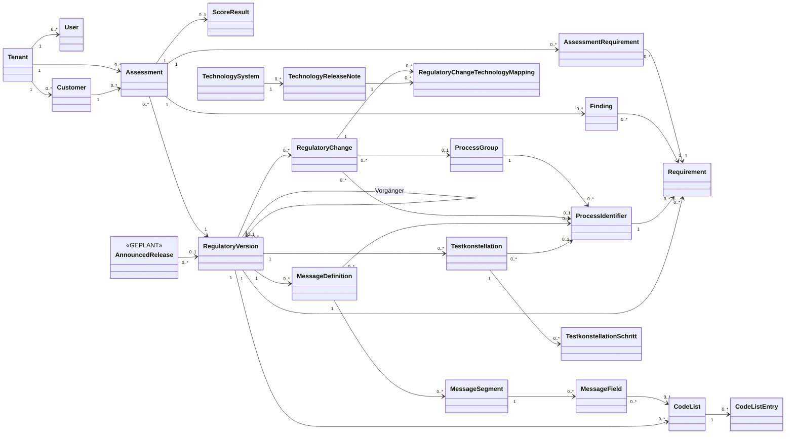

# Atlas — Klassendiagramm des Datenmodells

Vollständige Übersicht aller persistierten Entitäten von Atlas: bestehende
SQLAlchemy-Modelle aus [`backend/app/models.py`](../backend/app/models.py) sowie
die geplanten Entitäten aus dem Fahrplan in `Atlas_Gesamtdokument.md`, Teil B.

**Stand:** 03.09.2026 · **Quelle:** `backend/app/models.py`, `backend/app/seed_data.py`,
`Atlas_Gesamtdokument.md` (Abschnitte 11–15)

---

## Lesehilfe

| Konvention | Bedeutung |
|---|---|
| `id` | Primärschlüssel (`Integer`, autoincrement) |
| `*_id` | Fremdschlüssel auf die gleichnamige Tabelle |
| `%% GEPLANT` | Entität ist noch **nicht** implementiert — konzeptioneller Vorgriff |
| `text` | SQLAlchemy `Text` (Langtext), `str` = `String` |
| `"1" --> "0..*"` | Kardinalität von links nach rechts gelesen |

**Zentrale Architektur-Entscheidung (Abschnitt 13.1):** Nicht alles wird mandantengetrennt.
Die regulatorischen Referenzdaten (Gruppe 3), die EDIFACT-Wissensbasis (Gruppe 4) und die
Testkonstellationen (Gruppe 5) hängen bewusst an `regulatory_version_id` und **nicht** am
Tenant — es ist geteiltes Atlas-Wissen, kein Kundengeheimnis. Nur die Kundendaten
(Gruppe 2) tragen `tenant_id`.

**Der Angelpunkt des Modells ist `RegulatoryVersion`.** Kundendaten, Wissensbasis,
Formatänderungen und Testkonstellationen hängen alle daran — "kein Assessment ohne
regulatorischen Stand" (Abschnitt 12.1).

---

## 1. Übersicht — Entitäten und Beziehungen

Reduzierte Darstellung ohne Felder, um die Struktur auf einen Blick zu zeigen.

---

## 2. Vollständiges Klassendiagramm

Alle Felder mit Datentypen, gruppiert nach fachlicher Ebene.

```mermaid
classDiagram
    direction TB

    %% =====================================================================
    %% Gruppe 1 — Mandanten & Auth (Abschnitt 13)
    %% =====================================================================
    namespace G1_Mandanten_und_Auth {
        class Tenant {
            +int id
            +str name
            +str slug
            +bool is_active
            +datetime created_at
            +str email_domain
            +str sso_provider
            +str sso_tenant_id
        }

        class User {
            +int id
            +str email
            +str password_hash
            +int tenant_id
            +bool is_active
            +bool is_atlas_admin
            +datetime created_at
            +datetime last_login_at
        }
    }

    %% =====================================================================
    %% Gruppe 2 — Kundendaten (mandantengetrennt, tragen tenant_id)
    %% =====================================================================
    namespace G2_Kundendaten {
        class Customer {
            +int id
            +str name
            +str market_role
            +str sector
            +int tenant_id
        }

        class Assessment {
            +int id
            +int customer_id
            +int tenant_id
            +int regulatory_version_id
            +str business_scenario
            +str sector
            +str segments_gas
            +str segments_strom
            +str customer_segments
            +str status
            +datetime created_at
        }

        class AssessmentRequirement {
            +int id
            +int assessment_id
            +int requirement_id
            +str relevance_status
            +str implementation_status
            +str test_status
            +str result_status
            +str evidence_status
            +text comment
            +str responsible_person
            +datetime last_test_date
            +str data_source
            +str import_source_name
            +datetime last_synced_at
        }

        class ScoreResult {
            +int id
            +int assessment_id
            +float regulatory_coverage
            +float quality_grade
            +float implementation_quality
            +float test_quality
            +float evidence_quality
            +float actuality
            +datetime calculated_at
        }

        class Finding {
            +int id
            +int assessment_id
            +int requirement_id
            +str severity
            +str title
            +text description
            +text recommendation
        }
    }

    %% =====================================================================
    %% Gruppe 3 — Regulatorische Referenzdaten (geteilt, kein tenant_id)
    %% =====================================================================
    namespace G3_Regulatorische_Referenzdaten {
        class RegulatoryVersion {
            +int id
            +str name
            +str sector
            +str status
            +str source_reference
            +bool is_active
            +datetime valid_from
            +datetime created_at
            +datetime updated_at
            +int predecessor_version_id
            +text summary
        }

        class RegulatoryChange {
            +int id
            +str title
            +text description
            +str category
            +int process_group_id
            +int pi_id
            +str risk
            +str effort
            +int effort_person_days
            +text recommendation
            +str source_url
            +str message_type
            +str status
            +str origin
            +int regulatory_version_id
            +datetime created_at
            +datetime updated_at
            +effective_message_type() str
        }

        class Requirement {
            +int id
            +str code
            +str title
            +text description
            +int pi_id
            +str transaction_reason
            +str response_code
            +str criticality
            +float weight
            +bool applies_to_slp
            +bool applies_to_rlm
            +bool applies_to_imsys
            +bool applies_to_tlp
            +bool applies_to_gas
            +bool applies_to_strom
            +bool is_conditional
            +int regulatory_version_id
        }

        class ProcessIdentifier {
            +int id
            +str pi_number
            +str name
            +str sender_role
            +str receiver_role
            +str message_type
            +int process_group_id
            +str criticality
            +float weight
        }

        class ProcessGroup {
            +int id
            +str code
            +str name
            +int sequence
        }
    }

    %% =====================================================================
    %% Gruppe 3b — Technology Intelligence / Ebene 2 (Tabellen leer)
    %% =====================================================================
    namespace G3b_Technology_Intelligence {
        class TechnologySystem {
            +int id
            +str name
            +str vendor
        }

        class TechnologyReleaseNote {
            +int id
            +int technology_system_id
            +str title
            +text own_summary
            +str external_url
        }

        class RegulatoryChangeTechnologyMapping {
            +int id
            +int regulatory_change_id
            +int technology_release_note_id
        }
    }

    %% =====================================================================
    %% Gruppe 4 — Wissensbasis EDIFACT (Abschnitt 14.2, Tabellen noch leer)
    %% =====================================================================
    namespace G4_Wissensbasis_EDIFACT {
        class MessageDefinition {
            +int id
            +int regulatory_version_id
            +str nachrichtentyp
            +str version
            +str sparte
            +text beschreibung
            +str pi_nummer
            +int pi_id
            +str quelle_dokument
            +str quelle_hash
            +str quelle_kapitel
            +str quelle_kapitel_titel
            +int quelle_seite_von
            +int quelle_seite_bis
        }

        class MessageSegment {
            +int id
            +int message_definition_id
            +str segment_code
            +int position
            +str bezeichnung
            +bool pflicht
            +str kardinalitaet
            +bool wiederholbar
            +str segmentgruppe
            +str ahb_zeile
            +str pflichtigkeit
            +text bedingung
            +text bedingung_raw
            +str bedingung_referenzen
            +int quelle_seite
        }

        class MessageField {
            +int id
            +int segment_id
            +str position
            +str bezeichnung
            +str datentyp
            +int laenge
            +bool pflicht
            +int codelist_id
            +str beispielwert
            +text bedingung
            +text bedingung_raw
            +str bedingung_referenzen
            +str segmentgruppe
            +str code
            +str pflichtigkeit
            +int quelle_seite
        }

        class CodeList {
            +int id
            +int regulatory_version_id
            +str name
            +str nachrichtentyp
            +text beschreibung
        }

        class CodeListEntry {
            +int id
            +int codelist_id
            +str code
            +str bedeutung
            +date gueltig_ab
            +date gueltig_bis
        }
    }

    %% =====================================================================
    %% Gruppe 5 — Testkonstellationen (Abschnitt 14.2, Tabellen noch leer)
    %% =====================================================================
    namespace G5_Testkonstellationen {
        class Testkonstellation {
            +int id
            +int regulatory_version_id
            +str titel
            +str sparte
            +str segment
            +str marktrolle
            +int prozess_pi_id
            +bool ist_negativfall
            +text beschreibung
            +text erwartetes_ergebnis
        }

        class TestkonstellationSchritt {
            +int id
            +int konstellation_id
            +int reihenfolge
            +str nachrichtentyp
            +str sender_rolle
            +str empfaenger_rolle
            +str pi_nummer
            +text beschreibung
            +text edifact_beispiel
        }
    }

    %% =====================================================================
    %% Gruppe 6 — Monitoring
    %% GEPLANT: existiert noch nicht in models.py. Pipeline-Schritt 1 aus
    %% Abschnitt 11.2 ("Datei-Hash vs. letzter bekannter Stand"), im Backlog
    %% als Punkt 24 mit Auslöser "erster Pilotkunde" (Abschnitt 15.4).
    %% =====================================================================
    namespace G6_Monitoring {
        class AnnouncedRelease {
            <<GEPLANT>>
            +int id
            +str quelle
            +str mitteilung_nummer
            +str titel
            +str dokument_url
            +str dokument_hash
            +date veroeffentlicht_am
            +date gueltig_ab
            +str status
            +int regulatory_version_id
            +datetime entdeckt_am
            +datetime zuletzt_geprueft_am
        }
    }

    %% ---------------------------------------------------------------------
    %% Beziehungen Gruppe 1 -> Gruppe 2
    %% ---------------------------------------------------------------------
    Tenant "1" --> "0..*" User : hat Nutzer
    Tenant "1" --> "0..*" Customer : hat Kunden
    Tenant "1" --> "0..*" Assessment : denormalisiert

    %% ---------------------------------------------------------------------
    %% Beziehungen innerhalb Gruppe 2
    %% ---------------------------------------------------------------------
    Customer "1" --> "0..*" Assessment : mehrere Testläufe
    Assessment "1" *-- "0..*" AssessmentRequirement : Status je Anforderung
    Assessment "1" *-- "0..1" ScoreResult : genau ein Ergebnis
    Assessment "1" *-- "0..*" Finding

    %% ---------------------------------------------------------------------
    %% Beziehungen Gruppe 2 -> Gruppe 3
    %% ---------------------------------------------------------------------
    Assessment "0..*" --> "1" RegulatoryVersion : geprüft gegen
    AssessmentRequirement "0..*" --> "1" Requirement
    Finding "0..*" --> "1" Requirement

    %% ---------------------------------------------------------------------
    %% Beziehungen innerhalb Gruppe 3
    %% ---------------------------------------------------------------------
    ProcessGroup "1" --> "0..*" ProcessIdentifier
    ProcessIdentifier "1" --> "0..*" Requirement
    RegulatoryVersion "1" --> "0..*" Requirement : unique code je Version
    RegulatoryVersion "1" --> "0..*" RegulatoryChange
    RegulatoryVersion "0..1" --> "0..*" RegulatoryVersion : Vorgängerversion
    RegulatoryChange "0..*" --> "0..1" ProcessGroup
    RegulatoryChange "0..*" --> "0..1" ProcessIdentifier

    %% ---------------------------------------------------------------------
    %% Beziehungen Gruppe 3b (N:M über Mapping-Tabelle)
    %% ---------------------------------------------------------------------
    TechnologySystem "1" --> "0..*" TechnologyReleaseNote
    RegulatoryChange "1" --> "0..*" RegulatoryChangeTechnologyMapping : n-zu-m
    TechnologyReleaseNote "1" --> "0..*" RegulatoryChangeTechnologyMapping : n-zu-m

    %% ---------------------------------------------------------------------
    %% Beziehungen Gruppe 4
    %% ---------------------------------------------------------------------
    RegulatoryVersion "1" --> "0..*" MessageDefinition
    MessageDefinition "0..*" --> "0..1" ProcessIdentifier : pi_id optional
    MessageDefinition "1" *-- "0..*" MessageSegment : geordnet
    MessageSegment "1" *-- "0..*" MessageField
    MessageField "0..*" --> "0..1" CodeList : erlaubte Werte
    RegulatoryVersion "1" --> "0..*" CodeList
    CodeList "1" *-- "0..*" CodeListEntry

    %% ---------------------------------------------------------------------
    %% Beziehungen Gruppe 5
    %% ---------------------------------------------------------------------
    RegulatoryVersion "1" --> "0..*" Testkonstellation
    Testkonstellation "0..*" --> "0..1" ProcessIdentifier
    Testkonstellation "1" *-- "0..*" TestkonstellationSchritt : geordnet

    %% ---------------------------------------------------------------------
    %% Beziehungen Gruppe 6 (GEPLANT)
    %% ---------------------------------------------------------------------
    AnnouncedRelease "0..*" --> "0..1" RegulatoryVersion : erzeugt bei Kuration
```

---

## 3. Umsetzungsstand je Gruppe

| Gruppe | Entitäten | Modell | Tabelle befüllt | Bemerkung |
|---|---|---|---|---|
| 1 — Mandanten & Auth | `Tenant`, `User` | ✅ | ✅ | SSO-Felder vorhanden, Entra-Anbindung in `oidc.py` |
| 2 — Kundendaten | `Customer`, `Assessment`, `AssessmentRequirement`, `ScoreResult`, `Finding` | ✅ | ✅ | Kern des MVP (Stufe 1, Selbstauskunft) |
| 3 — Regulatorische Referenzdaten | `RegulatoryVersion`, `RegulatoryChange`, `Requirement`, `ProcessIdentifier`, `ProcessGroup` | ✅ | ✅ | 16 PIs, ~133 Requirements aus `seed_data.py` |
| 3b — Technology Intelligence | `TechnologySystem`, `TechnologyReleaseNote`, `RegulatoryChangeTechnologyMapping` | ✅ | ⬜ leer | Ebene 2, ohne Kuratoren-UI (Abschnitt 11, Backlog 25) |
| 4 — Wissensbasis EDIFACT | `MessageDefinition`, `MessageSegment`, `MessageField`, `CodeList`, `CodeListEntry` | ✅ | ⬜ leer | Befüllung über `import_ahb.py` / `regulatory_extraction.py` |
| 5 — Testkonstellationen | `Testkonstellation`, `TestkonstellationSchritt` | ✅ | ⬜ leer | Ableitung aus Profil + Prozess, noch keine Generator-Logik |
| 6 — Monitoring | `AnnouncedRelease` | ⬜ **GEPLANT** | ⬜ | Pipeline-Schritt 1 (11.2), Backlog 24 |

---

## 4. Fachliche Anmerkungen zum Modell

### 4.1 Bewusste Denormalisierungen

`Assessment.tenant_id` und `Assessment.sector` sind zusätzlich zum `Customer` gespeichert,
obwohl sie fachlich von dort abgeleitet werden. Grund: Assessments werden an mehreren
Stellen (Import, Impact-Berechnung, Score-Berechnung) über die nackte ID geladen — mit
eigener Spalte ist der Tenant-Filter dort eine sichtbare Einzeile statt eines leicht
vergessenen Joins. Beide Werte werden beim Anlegen übernommen und nie unabhängig geändert.

### 4.2 Sparten und Segmente

`Assessment.segments_gas` und `Assessment.segments_strom` sind bewusst **getrennte**
CSV-Mengen und keine gemeinsame Menge: bei „Gas (SLP) + Strom (iMSys)" würde eine
gemeinsame Menge `{slp, imsys}` eine Anforderung durchlassen, die nur für Gas **und**
nur für iMSys gilt — eine Kombination, die dieser Kunde gar nicht hat.
`customer_segments` ist die Vereinigung beider Mengen und dient **nur der Anzeige**.

### 4.3 Eindeutigkeit über Versionen hinweg

- `Requirement`: `UNIQUE(code, regulatory_version_id)` — derselbe Code muss in mehreren
  Versionen parallel vorkommen können, sonst funktioniert die Diff-Logik nicht.
- `MessageDefinition`: `UNIQUE(regulatory_version_id, nachrichtentyp, pi_nummer, quelle_kapitel)`
  — derselbe Prüfidentifikator in einer anderen Fassung ist fachlich nicht dasselbe Objekt,
  und ein PI kann in mehreren Anwendungsübersichten auftauchen.

### 4.4 Provenance in der Wissensbasis

Jede extrahierte Zeile trägt ihre Herkunft (`quelle_dokument`, `quelle_hash`,
`quelle_kapitel`, `quelle_seite`). `bedingung_raw` hält den unveränderten Zellinhalt
(z.B. `"Muss [28] ∧ [64]"`), `bedingung` die aufgelöste Interpretation — der Rohwert
wird nie verworfen, weil die Auflösung eine Interpretation ist und die Quelle prüfbar
bleiben muss.
